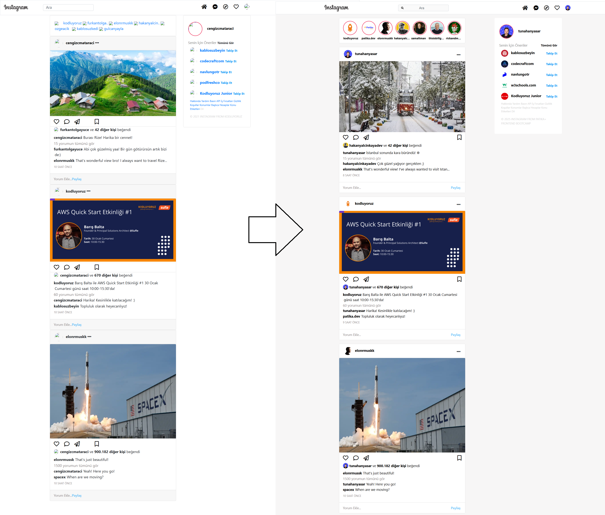
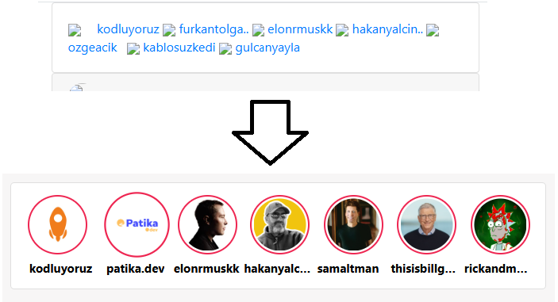

# :camera: Instagram Clone Project

[🇹🇷 Click for Turkish README.md](./README.tr.md)

*Created on : Feb 19, 2025*

* This project was created as **Week-3 / Assignment-2 / Instagram Clone** for the Patika Frontend Bootcamp.
* Developed using **HTML**, **CSS**, and **Bootstrap 4**.
* The style and layout were implemented by following the steps in **tasks.txt** as provided by Patika.
* Offers a responsive and modern design similar to the real Instagram interface.
* Features a navbar, story area, posts, and a sticky sidebar for a complete social media experience.

---

## 🌐 Live Demo

Visit the live website: [Instagram Clone - Bootstrap](https://instagram-clone-bootstrap-three.vercel.app/)

---

## :computer: Installation and Usage

1. Clone the project:
```bash
git clone https://github.com/tunahanyasar/instagram-clone-bootstrap.git
```
2. Navigate to the project directory:
```bash
cd instagram-clone-bootstrap
```
3. Open `index.html` in a web browser.

---

## 📜 Project Structure

:open_file_folder: **Folders;**
* `index.html` - Main page
* `css/style.css` - Custom stylesheet
* `assets/` - Profile and post images
* `img-page/` - Screenshots for the README
* `tasks.txt` - List of completed steps

### Main Components
- **Navbar:** Fixed top menu, search bar, and icons
- **Story Area:** Horizontally scrollable, hover-effect story cards
- **Post Area:** Responsive, card-based posts
- **Sidebar:** Sticky on the right, with suggestions and user panel

---

## :star2: Key Features

- Responsive design closely resembling Instagram
- Mobile-friendly with Bootstrap grid system
- Modern user experience with sticky sidebar
- Hover effects on story and post cards
- FontAwesome icons and custom placeholder icons

---

## 💡 Technologies Used

**Frontend:**
* HTML5
* CSS3
* Bootstrap 4
* FontAwesome

---

## 🎯 Project Goals

1. **User Experience**
   - Navigation and appearance similar to real Instagram
   - Responsive design for both mobile and desktop
2. **Technical Achievements**
   - Effective use of Bootstrap grid and sticky features
   - Modern CSS techniques and responsive layout

---

## 📸 Screenshots

### Main Page


### Story Cards


### Post Card


### Sidebar


### Before / After Styling
**Before:**


**After:**


---

## 📞 Contact

[Tunahan Yaşar](https://github.com/tunahanyasar)

* GitHub: [@tunahanyasar](https://github.com/tunahanyasar)
* LinkedIn: [Tunahan Yaşar](https://www.linkedin.com/in/tunahan-yasar/) 