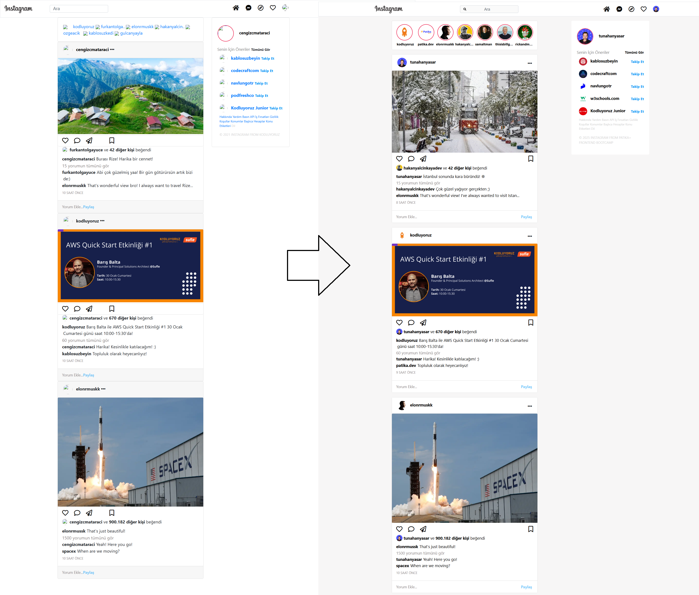
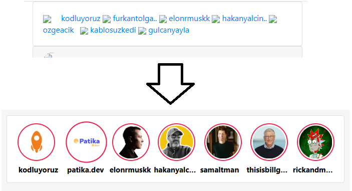
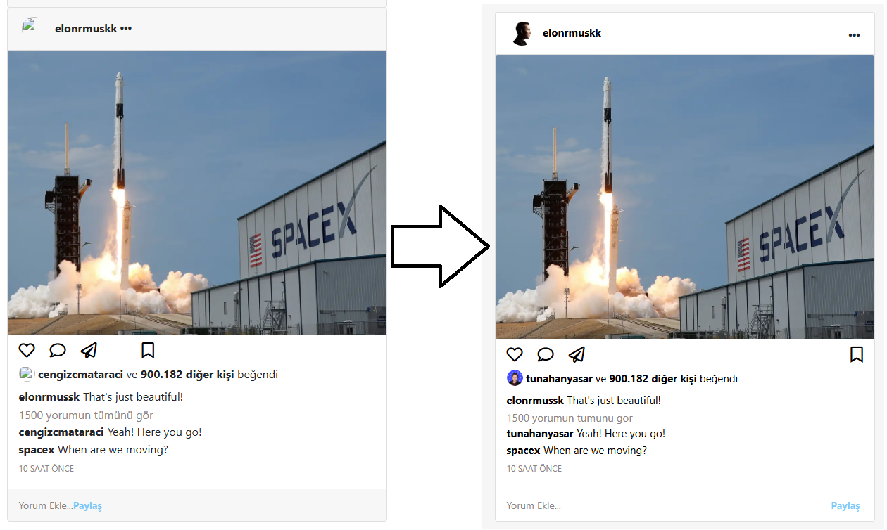
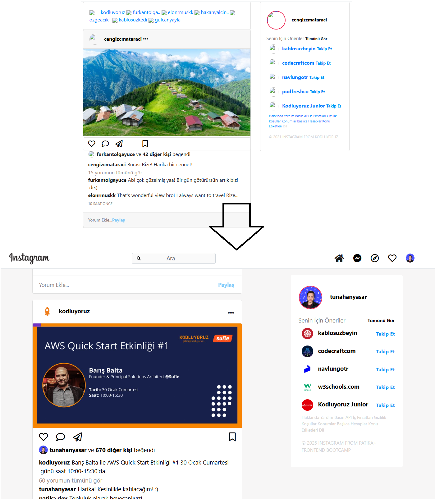
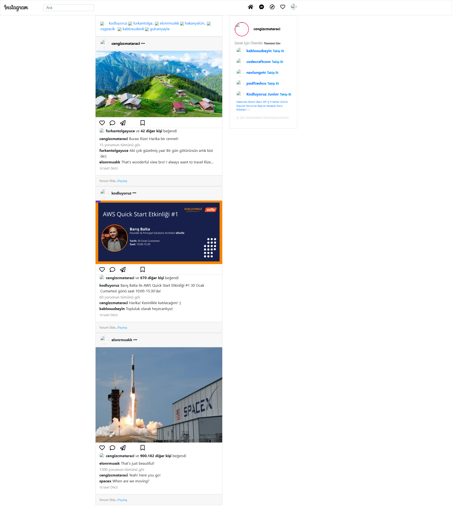
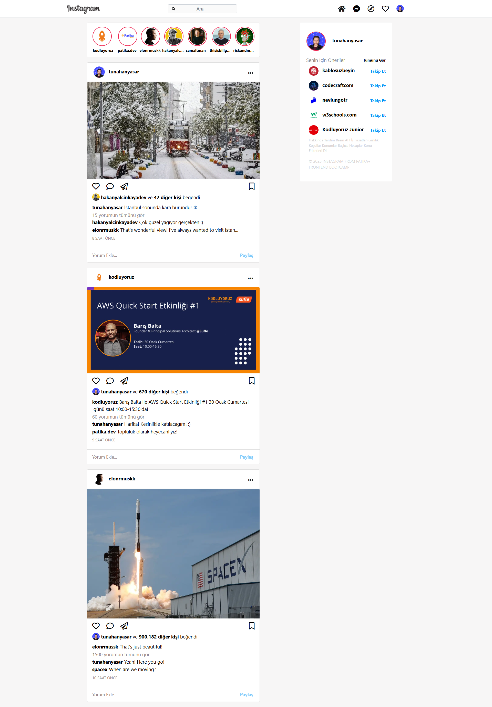

# :camera: Instagram Clone Projesi

[🇬🇧 İngilizce README.md için tıklayın](./README.md)

* Bu proje, Patika Frontend Bootcamp'i için oluşturulan **Hafta-3 / Ödev-2 / Instagram Clone** projesidir.
* **HTML**, **CSS** ve **Bootstrap 4** kullanılarak geliştirilmiştir.
* Patika tarafından verilen Instagram Clone 
projesine **tasks.txt** içindeki adımları 
yerine getirerek **style** biçimlendirmesi 
yaptım.
* Gerçek Instagram arayüzüne benzer, responsive ve modern bir tasarım sunar.
* Navbar, story alanı, postlar ve sağda sticky sidebar ile tam bir sosyal medya deneyimi sunar.

---

## 🌐 Canlı Demo

> (Canlı demo linki eklenebilir)

---

## :computer: Kurulum ve Kullanım

1. Projeyi klonlayın:
```bash
git clone https://github.com/tunahanyasar/instagram-clone-bootstrap.git
```
2. Proje dizinine gidin:
```bash
cd instagram-clone-bootstrap
```
3. `index.html` dosyasını bir web tarayıcısında açın.

---

## 📜 Sayfa Yapısı

:open_file_folder: **Klasörler;**
* `index.html` - Ana sayfa
* `css/style.css` - Özel stil dosyası
* `assets/` - Profil ve post görselleri
* `img-page/` - README için ekran görüntüleri
* `tasks.txt` - Yapılan adımların listesi

### Ana Bileşenler
- **Navbar:** Sabit üst menü, arama çubuğu ve ikonlar
- **Story Alanı:** Yatay kaydırmalı, hover efektli story kartları
- **Post Alanı:** Responsive, kart yapısında postlar
- **Sidebar:** Sağda sticky, öneriler ve kullanıcı paneli

---

## :star2: Öne Çıkan Özellikler

- Gerçek Instagram arayüzüne yakın responsive tasarım
- Bootstrap grid sistemi ile mobil uyum
- Sticky sidebar ile modern kullanıcı deneyimi
- Story ve post kartlarında hover efektleri
- FontAwesome ikonlar ve özel placeholder ikonları

---

## 💡 Kullanılan Teknolojiler

**Frontend:**
* HTML5
* CSS3
* Bootstrap 4
* FontAwesome

---

## 🎯 Proje Hedefleri

1. **Kullanıcı Deneyimi**
   - Gerçek Instagram'a yakın gezinme ve görünüm
   - Mobil ve masaüstü uyumlu tasarım
2. **Teknik Başarılar**
   - Bootstrap grid ve sticky özelliklerinin etkin kullanımı
   - Modern CSS teknikleri ve responsive yapı

---

## 📸 Ekran Görüntüleri

### Ana Sayfa


### Story Kartları


### Post Kartı


### Sidebar


### Stil Öncesi / Sonrası
**Önce:**


**Sonra:**


---

## 📞 İletişim

[Tunahan Yaşar](https://github.com/tunahanyasar)

* GitHub: [@tunahanyasar](https://github.com/tunahanyasar)
* LinkedIn: [Tunahan Yaşar](https://www.linkedin.com/in/tunahan-yasar/)

